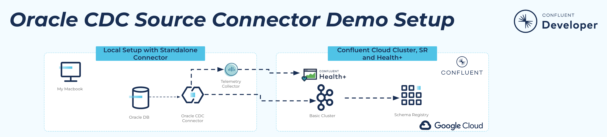
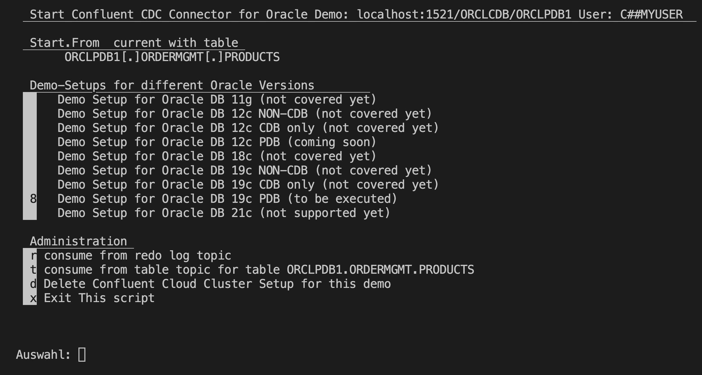
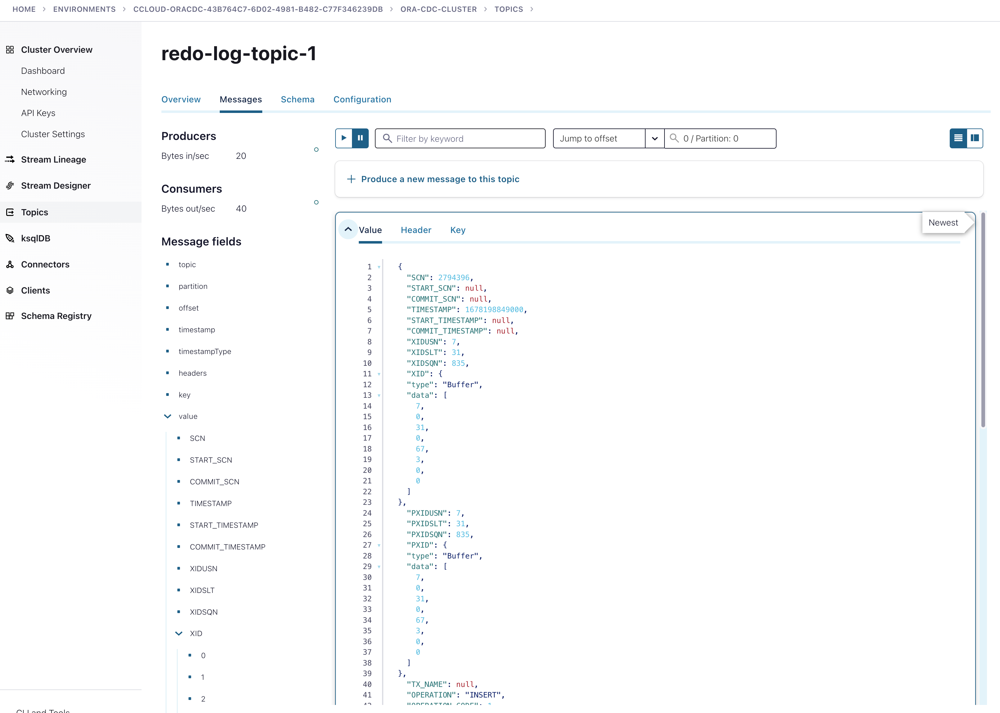
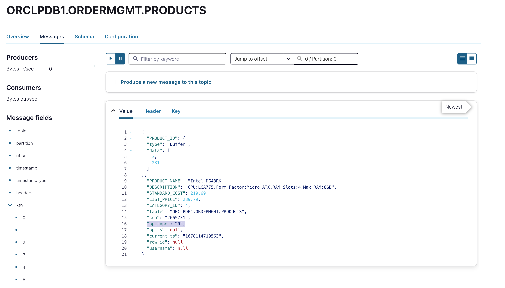
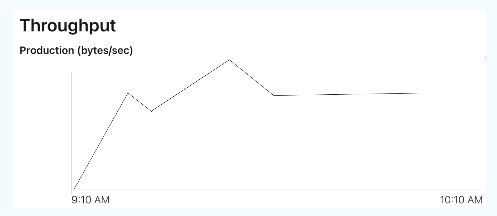
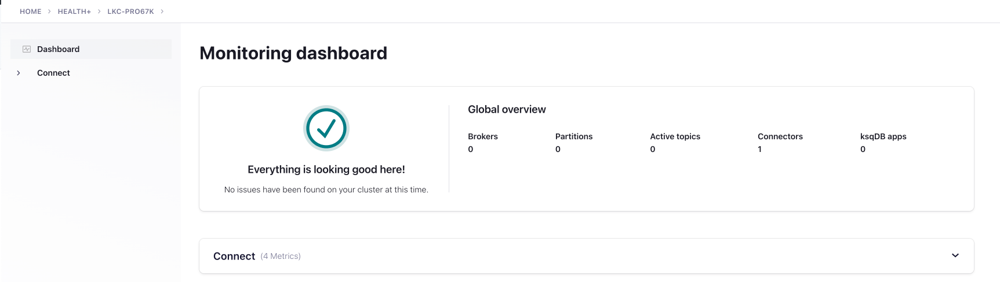

# Confluent CDC Connector plug and play demo (BYODB)
Confluent CDC Connector Plug and Play Demo. Use and bring your own DB  and play around with a Confluent Cloud cluster including Monitoring. The big advantage is that you can test your requirements very fast and measure throughput very easily. Monitoring is included in Confluent Cloud. The only 2 things you have to config:
 * add a CDC User with all the privileges this user needs, prepare the database for CDC
 * add your DB setup into config.properties

Then you can run the `00_StartConfluentCDCDemoSetup.sh` Script, which build basic cluster and a schema registry in Confluent Cloud. The connector will be run as self-managed connector and can be run, wherever it makes sense for you. We add Health+ Telemetry to that connector, so that you everything to monitor in the Confluent Cloud Control Plane.



## Setup and configuration

We need to run 3 main things for this demo:
* An Oracle Database (11g,12c,18c,19c, 21c is still not supported)
    * Do it in a container ([covered here in this github repo](Readme_setup_DB_container.md))
    * or run your DB, when this is happening, you need to add your Database credentials
* Run a Confluent Cloud Cluster (covered here in this repo with a automatic build script)
* Run monitoring in Confluent Cloud for our Oracle CDC Connector (self-managed), here you need to create a credential in COnfluent Cloud for Health+
* and finally run a self-managed Oracle CDC Source Connector (covered here in this repo)
    * run the connector as a standalone Connector on your Desktop (in my case my MacBook, covered here in this github repo)
    * or run it in a container on docker
    * or run it in your k8s cluster

## The demo setup is then pretty easy:
* Run an Oracle Database in the correct Version 
    * Use a docker DB in different versions [covered here in this github repo](Readme_setup_DB_container.md)
    * or use your own DB
* Add your entries into `config.properties`. You the template and cp it `config.properties.template`
* Build the complete Demo environment by executing `00_StartConfluentCDCDemoSetup.sh` 
* Run the latest Confluent CDC Connector (Version 2.3.2) and run it standalone (later we will add support docker and k8s ), setup is documented [here](Readme_setup_CP_Connector.md)
* Start the connector `$CONFLUENT_HOME/bin/connect-standalone  ./cdc-connect-standalone.properties ./oraclecdc19c-config.properties`
* the CDC Connector is monitored via Health+ in Confluent Cloud


## Prerequisites:
* I am running MacOS for the Demo
* Have Oracle installed in the correct version or run database in docker (here I would recommend to have Oracle sql*plus installed as well)
        * Have docker desktop installed if you use a docker DB container in the demo
        * Have database setup finished to use CDC Connector, see [documentation](https://docs.confluent.io/kafka-connectors/oracle-cdc/current/prereqs-validation.html)
* Have a Confluent Cloud Account [Signup](https://confluent.cloud/signup) or [Login](https://confluent.cloud/login)
* Have a Confluent Health+ Access (API Key), [Enable Healht+](https://docs.confluent.io/platform/current/health-plus/enable-health-plus.html#enable-telemetry-for-health)
    * Create in Confluent Cloud a Service Account with API Key and Secret
    * Enable health+ Telemetry in the Connector (will be generated automatically in `cdc-connect-standalone.properties` config file)

# Run the demo
The DB is running and configured.

## add your entries to config.properties
Please add your entries into `config.properties`
```Bash
STARTDIR=<ENTER THE DIR WHERE YOUR SCRIPT will be executed>
# Health+ key
healthpluskey=<YOUR HEALTHPLUSKEY>
# Health+ key secret
healthplussecret=<YOUR HEALTHPLUSSECRET>
# Hostname of Oracle Databaser
oraserver=<Enter your host of oracle>
#Port of Oracle Database'
oraport=<your oracle port>
# SID of Oracle Database 
orasid=<your SID>
# Service Name of PDB
orapdbname=<your PDB Service name>
# Username in Oracle DB, which need all privs for the connector, need to be created in DB
orausername=<your ora user for CDC connector>
# Password of Oraxle Username
orapassword=<your password of oracle CDC user>
# Method how to read: Start from Current SNC=current or force_current, read only Data from Table: snapshot, or enter a valid SCN to start from or a valid timestamp
startfrom=<CDC Method default is current>
# Enter the name of the one table in the format PDB-Service-Name[.]SCHEMANAME[.]TABLENAME the connect need select priv for this table.
tablename=<which table should we use e.g. ORCLPDB1[.]ORDERMGMT[.]PRODUCTS>
# Plugin Path for the CDC Connector on your desktop
pluginpath=>YOUR INSTALLATION PATH OF THE CDC CONNECTOR>
```
## start the Cluster Setup and CDC Config generation
Build the Connector config files and the cluster in the cloud Cloud:
```bash
./00_StartConfluentCDCDemoSetup.sh
```
If you run this script you will first check that all data was given in `config.properties`. Please PRESS enter and then you will see a menu.



Form here you can 
* create the cluster , press 8 for 19c DB with PDB setup
* delete everything , Press d
* consume from redo log topic, Press r
* consume from table topic, Press t
* and leave men by pressing x

## Start Connect Standalone Worker

The connector have to be started manually.
```bash
cd /confluent-cdc-plug-n-play
$CONFLUENT_HOME/bin/connect-standalone  ./cdc-connect-standalone.properties ./oraclecdc19c-config.properties
# Status of CDC Connector in a 2nd terminal window
curl -s -X GET -H 'Content-Type: application/json' http://localhost:8083/connectors/Ora19cCDC_1/status | jq
```

## Add a new entry into the database
If you are not running on own DB, then you can use the following samples to change some data in the container database.
see e.g. [DB19c setup](Readme_setup_DB_container_DB19c.md)


## Monitoring the Demo
If everything is running you can monitor the complete demo.
Topics will created after the forst change in the database from connector:
Redo log Topic:


Table Topic:


Connector Throughput:


Health+ CDC Connector Dashboard:



# License
Oracle Database Enterprise Edition Versions have to licensed. Please contact Oracle.
Confluent Platform and Confluent Oracle CDC Connector need to be licensed as well. Confluent is offering an Evaluation License for 30 days. So, you can test for max 30 days alone. If this is not enough please contact Confluent.
To use Confluent Cloud you need to register first.